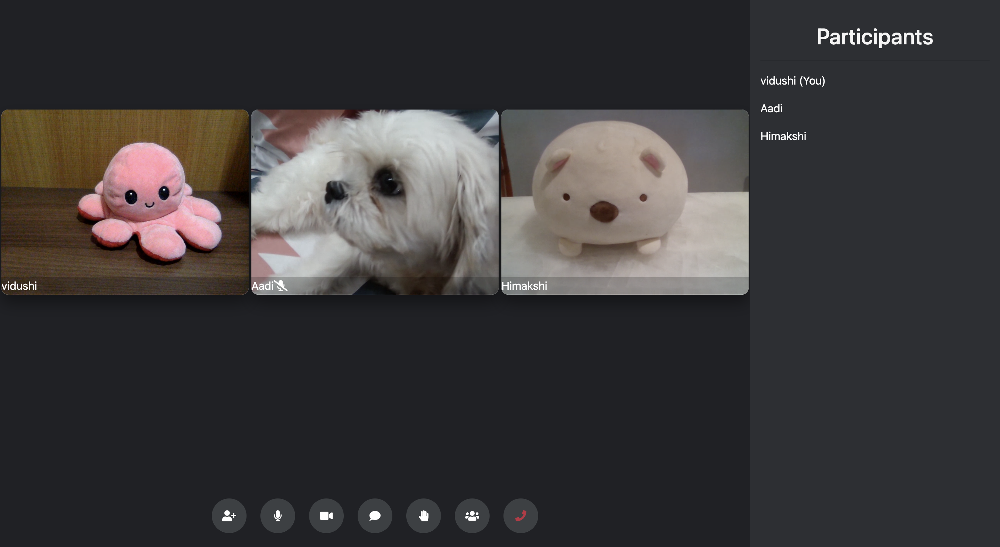

# bonjour-video-call

<!-- PROJECT LOGO -->
<br />
<p align="center">
  <a href="https://github.com/vidushityagi8/bonjour-video-app">
    <i class="bjr-logo"></i>
  </a>

  <h3 align="center">Bonjour</h3>

  <p align="center">
    Remote Connection with your team
    <br />
    <br />
    <a href="https://whispering-castle-61100.herokuapp.com/">Go To Website</a>
  </p>
</p>

<!-- ABOUT THE PROJECT -->

## About The Project

This project is the solution to the challenge posed by Microsoft India Team as a part of the Engagement & Mentorship Program – Engage 2021 for engineering students. The challenge statement was , "Your solution should be a fully functional prototype with at least one mandatory functionality - a minimum of two participants should be able connect with each other using your product to have a video conversation."

### Tech Stack Used

- Express
- Bootstrap
- JQuery
- SocketIO
- Peerjs

### Features incorpertated:

- Unique Room Creations
- Mutiple Participant Connectivity
- Video ON / OFF
- Mute / Unmute
- Chatroom During Call
- Show list of all Participants


## Code Overview

### Dependencies

- [ejs](https://ejs.co/) - For creating the website's frontend.
- [uuid](https://www.npmjs.com/package/uuid?activeTab=readme) - For generating random unique roomID's
- [express](https://github.com/expressjs/express) - The server for handling and routing HTTP requests.
- [peer](https://peerjs.com/) - The PeerServer for establishing connections between PeerJS clients.
- [socket.io](https://socket.io/docs/v4/index.html) - For enabling real-time bidirectional event-based communication among the peers.

### Application Structure

- `server.js` - This file defines our express server.
- `public/` - This folder contains all the static files.

  - `css/` - Contains all the css files.

    -`callPage/` - Contains all css files related to the callPage

  - `images/` - Contains all the images used in the website.

  - `js/` - Contains all the javascript files for the project.

- `views/` - This folder contains all the ejs files that need to be rendered.

  -`partials/` - Contains Header and Footer

<!-- GETTING STARTED -->

## Getting Started

Here are the instructions on setting up the project locally.
<br>
To get a local copy up and running, follow these steps.

### Prerequisites

x
First, you need to download and install node.js and npm.

- Download Node.js using this link.
  ```sh
  https://nodejs.org/en/download/
  ```

### Installation

1. Clone the repo
   ```sh
   git clone https://github.com/vidushityagi8/bonjour-video-app
   ```
2. Install NPM packages
   ```sh
   npm install
   ```
3. Run the app locally
   ```JS
   npm run devStart
   ```
4. Go to this url on your browser
   ```JS
   http://localhost:3000/
   ```

<!-- USAGE EXAMPLES -->

## Demo

- Home page. After entering username, user can either create a room or join an existing one.
  

- Two people can be connected in a unique room.
  

- Mutiple people can be connected in a unique room.
  

<!-- - Raise hand feature inspired by Microsoft Teams.
   -->

- List of all current participants using toggle.
  

- Chatroom using toggle.
  

- On clicking leave button.
  

<!-- CONTACT -->

## Contact

Email - vidushityagi8@gmail.com

Project Link: [https://github.com/vidushityagi8/bonjour-video-app](https://github.com/vidushityagi8/bonjour-video-app)
